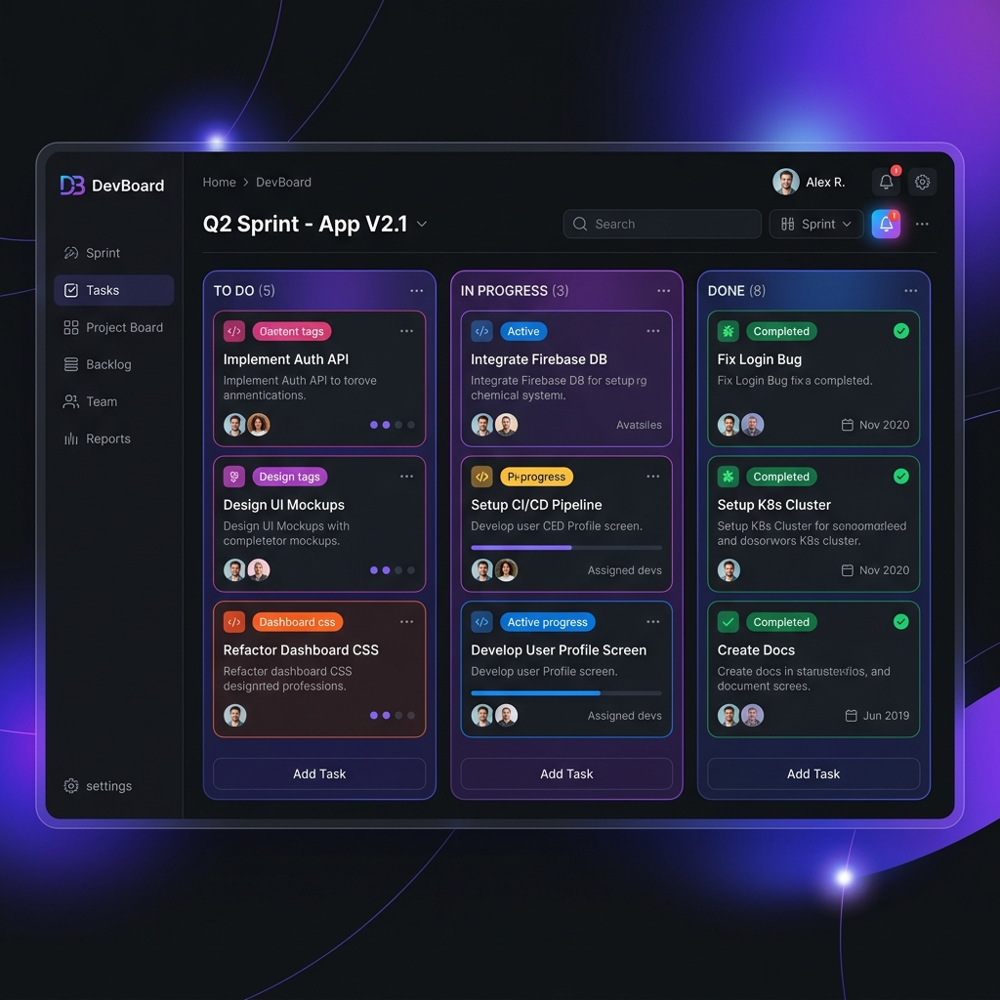

# DevBoard | Developer Task & Sprint Management System

DevBoard is a high-performance, real-time Developer Task & Sprint Management System built on the MERN stack. Designed specifically to showcase enterprise-level engineering standards, it features secure cookie-based JWT authentication, resilient Redis query caching with auto-invalidation, live two-way Socket.IO notifications, and a visual HTML5 drag-and-drop Kanban sprint board.

---

## 📸 Dashboard Preview



---

## 🚀 Key Features

1. **Secure Session Rotation (JWT + Cookies)**: Uses a secure, two-token system: short-lived JWT Access Tokens (15 min in memory) paired with HTTP-only Refresh Tokens (7 days in secure cookies) for seamless automatic re-auth.
2. **Visual Kanban Sprint Board**: A highly interactive front-end featuring standard HTML5 Drag & Drop event bindings to transition tasks between *To Do*, *In Progress*, and *Done* states.
3. **Resilient Redis Caching (60s TTL)**: High-speed Redis layer caching task query lists by project, sprint, and assignee, with instant pattern-based cache eviction (`tasks:*`) triggered on any write, update, or delete operations.
4. **Real-time Event Broadcasts (Socket.IO)**: Auto-subscribes users to private personal rooms (`user:<userId>`) and project rooms (`project:<projectId>`) to emit immediate in-app notifications on task assignment and sync board movements instantly across all active users.
5. **Activity Log Feed**: Automated system auditing that records task movements, creations, and deletions in a dedicated paginated Mongo collection.

---

## 🛠️ Tech Stack

- **Frontend**: React.js (Vite, Functional Hooks), Tailwind CSS, Lucide Icons, Socket.IO Client, Axios (transparent re-auth interceptors)
- **Backend**: Node.js, Express.js (MVC Architecture), Socket.IO Server, Mongoose
- **Databases & Cache**: MongoDB, Redis (IORedis/Redis Client)
- **DevOps**: Docker, Docker Compose, Multi-stage Nginx builds
- **Testing Tools**: Postman, Local script integrations

---

## 📂 Project Directory Structure

```
DevBoard/
├── backend/
│   ├── src/
│   │   ├── config/             # Databases, Redis, & Socket.IO configs
│   │   ├── controllers/        # Express handlers (MVC controllers)
│   │   ├── middleware/         # Auth, global error, validation filters
│   │   ├── models/             # Mongoose schemas
│   │   ├── routes/             # Route boundaries (JWT, Sprints, Tasks)
│   │   ├── utils/              # AppError operational class, catchAsync helpers
│   │   └── app.js              # Express app bootstrap
│   ├── Dockerfile
│   └── package.json
├── frontend/
│   ├── src/
│   │   ├── components/         # KanbanBoard, Navbar, PrivateRoute
│   │   ├── context/            # Global AuthContext & SocketContext
│   │   ├── pages/              # Login, Register, Dashboard, ProjectDetails
│   │   ├── services/           # Axios Base client (interceptors) and endpoints
│   │   ├── index.css           # Custom styles + Tailwind directives
│   │   └── main.jsx
│   ├── Dockerfile
│   ├── nginx.conf              # Custom Nginx redirect server configs
│   ├── tailwind.config.js
│   └── package.json
├── docker-compose.yml          # Container orchestrator
└── README.md
```

---

## ⚡ Setup & Installation

### Option A: Quick Docker Setup (Recommended)
Launch the entire backend stack (Express API, MongoDB, Redis Caching) in seconds.

1. Ensure **Docker** and **Docker Compose** are installed.
2. Clone the repository and navigate to the root directory.
3. Run the following command:
   ```bash
   docker-compose up --build
   ```
4. The backend API is now running at `http://localhost:5000` and the MongoDB + Redis instances are running locally inside containers.
5. Start the frontend development server:
   ```bash
   cd frontend
   npm install
   npm run dev
   ```
6. Open `http://localhost:5173` in your browser.

---

### Option B: Local Manual Setup

#### 1. Backend Setup
1. Navigate to the `backend` folder:
   ```bash
   cd backend
   ```
2. Install dependencies:
   ```bash
   npm install
   ```
3. Copy environment template and fill variables:
   ```bash
   cp .env.example .env
   ```
4. Ensure MongoDB and Redis are running locally on standard ports (`27017` and `6379`).
5. Start the development server:
   ```bash
   npm run dev
   ```

#### 2. Frontend Setup
1. Navigate to the `frontend` folder:
   ```bash
   cd ../frontend
   ```
2. Install dependencies:
   ```bash
   npm install
   ```
3. Copy environment template:
   ```bash
   cp .env.example .env
   ```
4. Start the development server:
   ```bash
   npm run dev
   ```
5. Open `http://localhost:5173` in your browser.

---

## 📝 API Endpoint Documentation

| Method | Endpoint | Access | Description | Payload Constraints |
| :--- | :--- | :--- | :--- | :--- |
| **POST** | `/api/auth/register` | Public | Register new user | `{ name, email, password, role }` |
| **POST** | `/api/auth/login` | Public | Login & set Refresh Token | `{ email, password }` |
| **POST** | `/api/auth/refresh` | Public | Request new access token | Uses `refreshToken` cookie |
| **POST** | `/api/auth/logout` | Public | Clear cookies & logout | Clears `refreshToken` cookie |
| **GET** | `/api/auth/users` | Private | Retrieve team list | Requires active JWT |
| **POST** | `/api/projects` | Admin/Manager | Create a new project | `{ name, description, members[] }` |
| **GET** | `/api/projects` | Private | Fetch user projects | Restricts non-admins to member lists |
| **GET** | `/api/projects/:id` | Private | Get project details | Restricts non-admins to member lists |
| **PUT** | `/api/projects/:id` | Admin/Manager | Update project details | `{ name, description, members[] }` |
| **DELETE** | `/api/projects/:id` | Admin/Manager | Delete a project | Deletes all cascade relations |
| **POST** | `/api/projects/:id/sprints` | Admin/Manager | Create a sprint under project | `{ name, startDate, endDate }` |
| **GET** | `/api/projects/:id/sprints` | Private | Get project sprint loops | Populates all sprints |
| **PUT** | `/api/projects/sprints/:sprintId` | Admin/Manager | Update a sprint properties | `{ name, status: "completed" }` |
| **POST** | `/api/tasks` | Private | Create a task | `{ title, projectId, sprintId, assignedTo }` |
| **GET** | `/api/tasks` | Private | Get tasks (cached in Redis) | Query params: `projectId`, `sprintId` |
| **PUT** | `/api/tasks/:id` | Private | Update task status or assignee | `{ status: "in-progress", assignedTo }` |
| **DELETE** | `/api/tasks/:id` | Admin/Manager | Delete a task | Triggers board refresh |
| **GET** | `/api/activity` | Private | Get paginated activity feeds | Query params: `projectId`, `page`, `limit` |

---

## 🔒 Security & Architecture Details
- **Password Protection**: Salted with `bcrypt` (12 rounds) before storage.
- **SQL/NoSQL Injection Safety**: Strict Mongo ObjectId schemas and body-validation checking via `express-validator` on all routes.
- **Graceful Failures**: Custom `AppError` operational error boundaries; Redis caching fails back directly to MongoDB query lines to avoid server timeouts.
