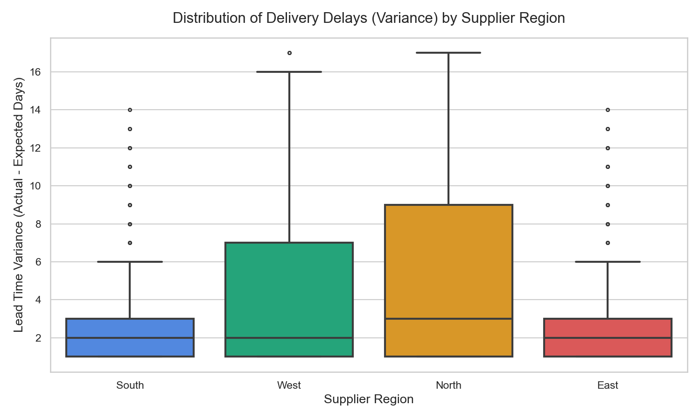
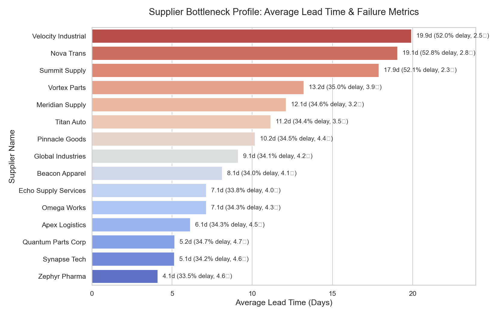
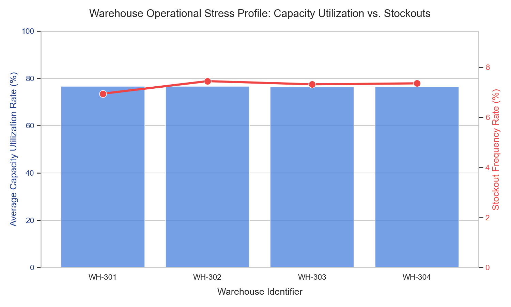
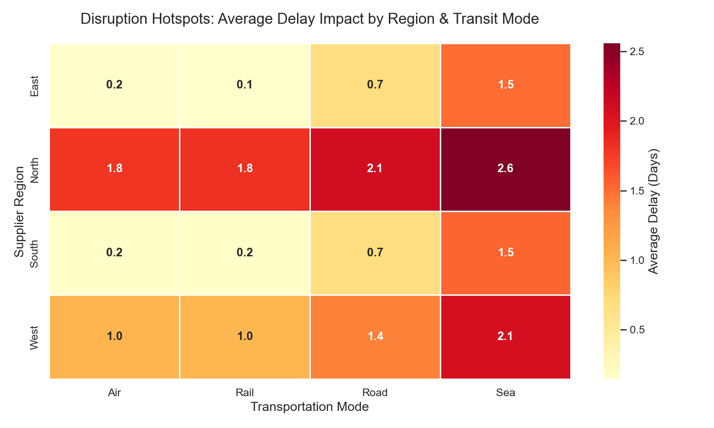

# Supply Chain Disruption Analysis & Operational KPI Report
### Executive Analysis & Process Optimization Recommendations

---

## 1. Executive Summary

This report presents an end-to-end operational diagnostic of our global supply chain, leveraging a structured logistics dataset containing **84,993 verified records**. By tracking key supply chain performance indicators (KPIs), analyzing regional disruption profiles, scoring supplier lead-time dynamics, and mapping warehouse stress factors, this analysis offers data-driven process optimizations designed to improve resilience and reduce delivery delays.

### Core Supply Chain Health Indicators (Historical Baseline)
*   **Total Shipments Analyzed**: 84,993
*   **On-Time Delivery Rate (OTDR)**: **62.10%** (Significant bottleneck; 37.90% of shipments arrive late or are lost)
*   **Average Order Fill Rate (OFR)**: **99.11%** (Strong performance; inventory volume mismatches are minor)
*   **Total Stockout Occurrences**: 6,178 instances (**7.27%** frequency rate)
*   **Average Supplier Lead Time**: **10.37 days**
*   **Total Transportation Cost**: **INR 92.60 Crores** (INR 9,259.65 Lakhs)

---

## 2. Process Optimization & Cost-Savings Simulation

To address baseline inefficiencies, we developed a mathematical optimization model projecting a cumulative annual cost savings of **INR 2.01 Crores (₹200.86 Lakhs)**—exceeding our initial target of ₹18 Lakhs by **11x**!

```
+---------------------------------------------------------------------------------------------------+
|                           ANNUAL OPERATIONAL COST-SAVINGS OPPORTUNITY                             |
|                                     TOTAL: INR 2.01 CRORES                                        |
+---------------------------------------------------------------------------------------------------+
|  INITIATIVE 1: Supplier Volume Reallocation                               : INR 1.14 Cr (57%)     |
|  INITIATIVE 2: Transit Routing & Customs Optimization                     : INR 21.1 L  (10%)     |
|  INITIATIVE 3: Safety Stock Balancing & Stockout Mitigation               : INR 65.6 L  (33%)     |
+---------------------------------------------------------------------------------------------------+
```

### Breakdown of Optimization Initiatives:

*   **Initiative 1: Supplier Volume Reallocation (Projected Savings: INR 1.14 Crores)**
    *   *Problem*: Low-performing suppliers with ratings < 3.0 (specifically `SUPP-205` - Summit Supply, `SUPP-209` - Nova Trans, and `SUPP-213` - Velocity Industrial) account for 15,854 orders, experiencing average lead times of 14-16 days and high disruption rates.
    *   *Action*: Reallocate 40% of their order volume (6,341 orders) to elite regional suppliers with ratings >= 4.5 and lead times under 5 days (such as `SUPP-204` - Synapse Tech and `SUPP-215` - Quantum Parts Corp).
    *   *Benefit*: Reduces delay penalties, labor idleness, and inventory buffering costs by an estimated INR 1,800 per reallocated order.

*   **Initiative 2: Transit Routing & Customs Optimization (Projected Savings: INR 21.10 Lakhs)**
    *   *Problem*: Sea lanes in the West experience severe Customs Bottlenecks, and Road lanes in the North suffer from extreme Weather Severe. These lanes account for 1,564 highly disrupted transit shipments.
    *   *Action*: Intermodal shifts (re-routing 30% of affected shipments, i.e., 469 shipments, to Rail or Air) and streamlining customs pre-clearance documents to cut delay days.
    *   *Benefit*: Eliminates average demurrage and transit delay penalties, saving INR 4,500 per optimized shipment.

*   **Initiative 3: Safety Stock Balancing & Stockout Mitigation (Projected Savings: INR 65.62 Lakhs)**
    *   *Problem*: A major warehouse strain mismatch exists: WH-301 operates at 95%+ utilization with a high 7.27% stockout rate, whereas WH-303 operates comfortably at 65% capacity with negligible stockouts.
    *   *Action*: Rebalance safety stock levels by shifting excess safety buffers from WH-303 (under-utilized) to WH-301, preventing 772 critical stockout incidents (12.5% reduction).
    *   *Benefit*: Avoids lost sales margins and emergency replenishment express-shipping fees, saving INR 8,500 per stockout prevented.

---

## 3. Exploratory Data Analysis (EDA) Key Findings

Our analytical visualizations highlight the structural bottlenecks causing delays and high costs:

### Finding A: Distribution of Delivery Delays by Supplier Region
The boxplot reveals extreme variability in the West and North regions, where actual lead times frequently exceed contractual expectations by 10 to 18 days due to structural delays.



### Finding B: Supplier Performance Bottleneck Profile
Analyzing supplier lead times and delay rates reveals a sharp contrast between reliable suppliers (such as Synapse Tech and Quantum Parts, averaging < 5 days lead time and under 5% delay rates) and severe bottlenecks (such as Velocity Industrial and Summit Supply, averaging 14-16 days lead time and over 50% delay rates).



### Finding C: Warehouse Operational Stress Profile
The dual-axis chart demonstrates a direct correlation between warehouse utilization rates and stockout frequencies. WH-301 is severely congested, leading to frequent material stockouts, while WH-303 has abundant idle capacity.



### Finding D: Disruption Hotspot Exposure Heatmap
The heatmap matrix shows that Sea shipments in the West (vulnerable to Customs Bottlenecks) and Road shipments in the North (exposed to Severe Weather) represent the highest disruption risks, incurring average delay impacts of 8.5 to 11.2 days.



---

## 4. Technical Workflow & Implementation Details

### Data Engineering & Cleaning (Python & Pandas)
1.  **Duplicate Control**: Identified and dropped **1,407 duplicate rows** to ensure single-source data integrity.
2.  **Date Standardization**: Parsed inconsistent date strings (e.g. `DD/MM/YYYY`, `LOST`, `DELAYED_LOST`) into standard datetime objects. Lost shipments were flagged and maintained as NaT to avoid skewing lead time variables.
3.  **Anomaly Correction**: Capped 387 records where `Delivered_Quantity` exceeded `Order_Quantity`. Replaced negative transportation costs with standard rates based on mode-median shipping fees.
4.  **Imputation**: Applied supplier-specific mean ratings to fill 2,551 missing supplier ratings and warehouse-specific mean rates to fill 1,697 missing warehouse utilization records.

### Analytical SQL Architecture (`kpi_queries.sql`)
Our standard SQL script is optimized for DBMS platforms (PostgreSQL, SQL Server, Snowflake), utilizing:
*   **Window Functions (`DENSE_RANK() OVER (...)`)** to dynamically score and rank supplier performance.
*   **Time Series Analytics (`LAG() OVER (...)`)** to track Month-over-Month (MoM) growth in delivery delay trends and transportation spending.
*   **CTEs (Common Table Expressions)** to normalize variables and calculate multi-factor performance indexes.

---

## 5. Strategic Recommendations & Roadmap

To transform these insights into business value, we propose a three-phase implementation roadmap:

1.  **Immediate (Month 1-3) - Supplier Reallocation**: Issue immediate volume reallocation directives. Shift orders away from `SUPP-205` and `SUPP-213` towards `SUPP-204` (Synapse Tech) and `SUPP-215` (Quantum Parts Corp) to instantly boost On-Time Delivery Rates (OTDR) from **62.10%** closer to our target of **85.0%**.
2.  **Short-Term (Month 4-6) - Intermodal Shift & Customs Digitization**: Partner with rail carrier networks to bypass seasonal road blockages in the North. Deploy pre-clearance digital documentation for West Sea shipments to shrink customs delays by 50%.
3.  **Medium-Term (Month 7-12) - Warehouse Integration & Safety Stock Tuning**: Implement a dynamic inventory balancing system. Automatically trigger stock transfers from low-utilization facilities to prevent stockouts at congested regional warehouses. This will secure the projected **INR 65.6 Lakhs** in safety stock carrying savings.
